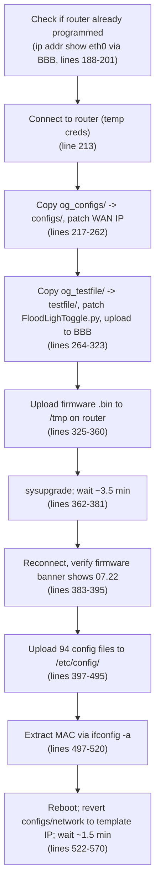
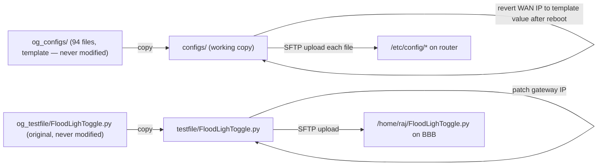
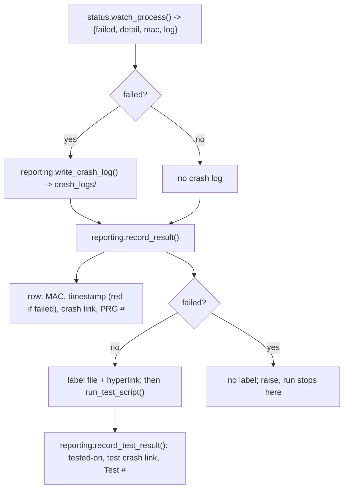

# WORKFLOW.md — TR Device

**Last commit:** `e96074a` (2026-08-04) — "Simplify onto a shared utility layer; delete dead abstractions"

## Recent changes (`e96074a`)

- **`prog_dev.py` was rewritten** onto the shared utility layer (943 → 361 lines). The Excel/crash-log/label handling described in §4 is no longer written out here at all — it is `resources/utilities/reporting.py`.
- **Three bugs went with it**: the double read of `process.stdout` (§1), the functional test running after a failed program (§1), and a leaked shell channel per `ssh_run_shell` call.
- **`teltonika.py` is unchanged.** §2 and §3 below still describe it accurately.

## 1. The two-process pipeline

`pages/program_page.py` `exec()`-loads `devices/TR/prog_dev.py` and calls `run_main_script(airport, gate, temp_pass, device)` (`devices/TR/prog_dev.py:199`). That function does **not** talk to hardware itself — it looks the gate up in Excel, launches `teltonika.py` as a separate child process, then runs the functional test and records the outcome.

```mermaid
sequenceDiagram
    participant PP as ProgramPage (exec'd prog_dev.py)
    participant TK as teltonika.py (subprocess)
    participant BBB as BeagleBone Black
    participant RTR as Router

    PP->>PP: lookup_excel(sheet, gate, device) — by header name; sets globals + valid_ip
    PP->>TK: status.watch_process(script_command(teltonika.py, ip, mask, gw, pass))
    TK->>BBB: SSH — check if router already programmed (ip addr show eth0)
    TK->>RTR: SSH (temp creds) — copy config templates, patch WAN IP
    TK->>BBB: SFTP — upload patched FloodLighToggle.py
    TK->>RTR: SFTP — upload firmware .bin, sysupgrade, wait ~3.5 min
    TK->>RTR: SSH (temp creds again) — verify firmware banner, push 94 config files
    TK->>RTR: shell — ifconfig -a, extract MAC
    TK->>RTR: reboot; revert local configs/network back to template IP
    TK-->>PP: stdout stream — consumed in ONE pass
    PP->>PP: reporting.record_result() — crash log, sheet stamp, label
    PP->>PP: run_test_script() — functional test via BBB (only if programming passed)
    PP->>PP: reporting.record_test_result()
```

Two ordering changes are load-bearing:

- **The child's stdout is read exactly once.** The old code looped over `process.stdout`, then looped again; the first loop drained the pipe, so the second — holding all the failure detection, MAC capture and crash logging — iterated an exhausted stream. Every run looked like a success. `status.watch_process` (`resources/utilities/status.py:127`) is now the single pass, shared with the Digi.
- **The functional test runs only after a successful program.** It used to run unconditionally, and before the (dead) error-handling loop, so a router that failed to program was then tested and failed again, more confusingly.

`teltonika.py` reads its four arguments as `sys.argv[1:5]` (`devices/TR/teltonika.py:19-23`) and exits immediately if launched with none. The command is built by `app_paths.script_command()` rather than `[sys.executable, ...]`, because in a packaged build `sys.executable` is the app itself.

## 2. `teltonika.py`'s 9 steps (as coded — unchanged)



Every step prints a verification message. Two output conventions are what `prog_dev.py` reacts to, and they are now defined once, in `resources/utilities/status.py`:

| Convention | Meaning |
| --- | --- |
| `Incorrect! ...` | This step failed. Sets the run's failure flag and becomes the crash-log detail. |
| `MAC Addr: xx:xx:...` | The device's MAC, written into the sheet and onto the label. |
| `Traceback` | An unhandled exception; also marks the run failed. |

A non-zero exit code from the child marks the run failed regardless of what it printed.

`teltonika.py` emits **no** `##STATUS##` milestone markers and TR ships no `checklist.json`, so the Status panel stays empty for this device. Adding both is the last step of the migration described in `CODE_EXPLAIN.md`.

## 3. Config file lifecycle (unchanged)



This copy-then-patch-then-revert pattern exists so the same templates can be reused for the next gate without re-cloning from a pristine backup. `configs/network`'s WAN IP is patched to the gate's real IP for the duration of the SFTP push, then reverted to the placeholder (`10.28.18.2`) once the router has rebooted (`devices/TR/teltonika.py:529-548`).

`prog_dev.py`'s `stage_test_script` (`:327`) does the `og_testfile/` half of this, and verifies the substitution actually landed before uploading.

## 4. Excel, crash-log and label output

**This no longer lives in `prog_dev.py`.** All of it is `resources/utilities/reporting.py`, shared with the Digi. `prog_dev.py` supplies the outcome and calls two functions.



Which cell gets written is decided by **header name**, through `reporting.COLUMNS`:

| Logical field | Header in the sheet |
| --- | --- |
| `mac` | `MAC Address` |
| `programmed_on` | `Router Programmed On` |
| `label` | `Label` |
| `crash_report` | `Crash Report` (1st occurrence) |
| `prg_count` | `PRG #` |
| `tested_on` | `Router Tested On` |
| `test_crash_report` | `Crash Report` (2nd occurrence) |
| `test_count` | `Test #` |

The old code addressed these as `column=7`, `column=8`, … `column=14`, hardcoded at each of four separate copies of the write logic. Reordering a spreadsheet template silently wrote to the wrong cells; now it cannot.

Two conventions `reporting` enforces:

- The `Router Programmed On` timestamp is **red on failure, black on success** — how an operator scanning the sheet spots a gate that needs redoing.
- **A failed run writes no label.** A printable label for a router that did not program is worse than none, because somebody can stick it on.
