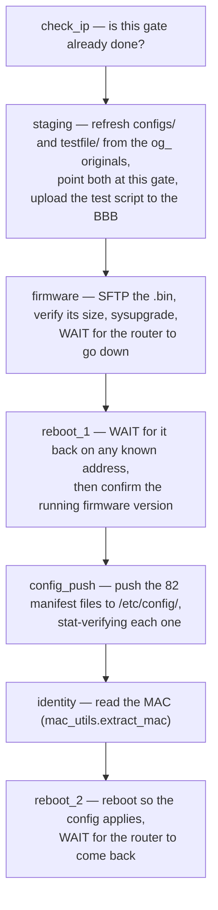
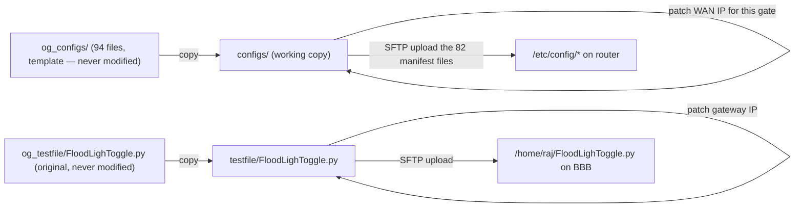
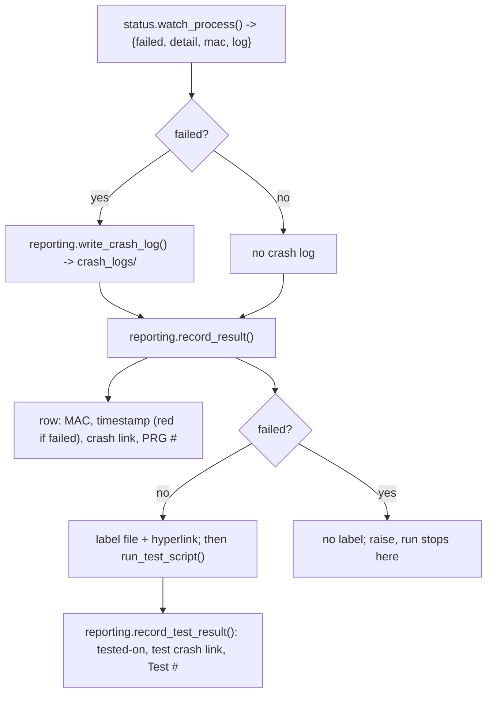

# WORKFLOW.md — TR Device

**Last commit:** `HEAD` (2026-08-04) — "Migrate teltonika.py onto the shared layer"

## Recent changes

**`teltonika.py` has now been migrated too**, so both halves of this device sit on the shared layer:

- It is seven dispatched milestones instead of a flat run of top-level statements — §2 is rewritten.
- **TR has a live Status checklist for the first time** (`checklist.json`), because the milestones emit `##STATUS##` markers.
- Fixed waits are gone: firmware install and both reboots now wait for the router to actually go down and come back.
- The 82 hardcoded `sftp.put()` calls became `config_manifest.json` — still exactly those 82, and deliberately not "every file in `configs/`". §3 explains why that distinction matters.
- The "revert the network file afterwards" step is gone; refreshing from `og_configs/` at the start of each run already made it redundant.

Earlier, in `e96074a`: `prog_dev.py` was rewritten onto the shared layer (943 → 364 lines), taking three bugs with it — the double read of `process.stdout` (§1), the functional test running after a failed program (§1), and a leaked shell channel per `ssh_run_shell` call.

## 1. The two-process pipeline

`pages/program_page.py` `exec()`-loads `devices/TR/prog_dev.py` and calls `run_main_script(airport, gate, temp_pass, device)` (`devices/TR/prog_dev.py:199`). That function does **not** talk to hardware itself — it looks the gate up in Excel, launches `teltonika.py` as a separate child process, then runs the functional test and records the outcome.

```mermaid
sequenceDiagram
    participant PP as ProgramPage (exec'd prog_dev.py)
    participant TK as teltonika.py (subprocess)
    participant BBB as BeagleBone Black
    participant RTR as Router

    PP->>PP: lookup_excel(sheet, gate, device) — by header name; sets globals + valid_ip
    PP->>TK: status.watch_process(script_command(teltonika.py, ip, mask, gw, pass))
    TK->>BBB: SSH — check if router already programmed (ip addr show eth0)
    TK->>RTR: SSH (temp creds) — copy config templates, patch WAN IP
    TK->>BBB: SFTP — upload patched FloodLighToggle.py
    TK->>RTR: SFTP — upload firmware .bin, sysupgrade, WAIT for down/up
    TK->>RTR: SSH — verify firmware version, push the 82 manifest config files
    TK->>RTR: SSH — read the MAC (mac_utils)
    TK->>RTR: reboot; WAIT for the router to come back
    TK-->>PP: stdout stream — consumed in ONE pass
    PP->>PP: reporting.record_result() — crash log, sheet stamp, label
    PP->>PP: run_test_script() — functional test via BBB (only if programming passed)
    PP->>PP: reporting.record_test_result()
```

Two ordering changes are load-bearing:

- **The child's stdout is read exactly once.** The old code looped over `process.stdout`, then looped again; the first loop drained the pipe, so the second — holding all the failure detection, MAC capture and crash logging — iterated an exhausted stream. Every run looked like a success. `status.watch_process` (`resources/utilities/status.py:127`) is now the single pass, shared with the Digi.
- **The functional test runs only after a successful program.** It used to run unconditionally, and before the (dead) error-handling loop, so a router that failed to program was then tested and failed again, more confusingly.

`teltonika.py` reads its four arguments as `sys.argv[1:5]` (`devices/TR/teltonika.py:19-23`) and exits immediately if launched with none. The command is built by `app_paths.script_command()` rather than `[sys.executable, ...]`, because in a packaged build `sys.executable` is the app itself.

## 2. `teltonika.py`'s seven milestones



Each is a function listed in `STEPS` (`devices/TR/teltonika.py:571`) and dispatched by `main()`. A failure raises `StepError`, which turns that milestone red in the Status panel and exits non-zero.

The capitalised **WAIT**s are the substantive change. They used to be `time.sleep()` calls chosen as worst-case padding — 3 min 15 s after `sysupgrade`, 1 min 30 s after the final reboot — so every run took the worst case and confirmed nothing. Each now watches port 22 go down and come back. `wait_for_any_port` gives the candidate addresses one shared deadline, because the router can return on the factory address or the configured one depending on how far the run got.

One milestone ends the run early rather than failing: `check_ip` raises `AlreadyProgrammed` when the BeagleBone shows a gate-address lease, and `main()` treats that as **exit code 0**. Somebody already programmed this gate; that is not an error. This preserves the old `sys.exit(0)` behaviour.

Every step also prints a verification message. Two output conventions are what `prog_dev.py` reacts to, and they are now defined once, in `resources/utilities/status.py`:

| Convention | Meaning |
| --- | --- |
| `Incorrect! ...` | This step failed. Sets the run's failure flag and becomes the crash-log detail. |
| `MAC Addr: xx:xx:...` | The device's MAC, written into the sheet and onto the label. |
| `Traceback` | An unhandled exception; also marks the run failed. |

A non-zero exit code from the child marks the run failed regardless of what it printed.

`teltonika.py` now also emits `##STATUS##` markers, and TR ships a `checklist.json`, so the Status panel works for this device. Seven of its nine rows come from `teltonika.py`; `label` and `testing` are reported by `prog_dev.py`, because both happen in that process after the hardware script has exited.

## 3. Config file lifecycle



Both pairs go through `resources/utilities/templating.py`, shared with `prog_dev.py`.

**Only 82 of the 94 files in `og_configs/` are pushed.** The list lives in `config_manifest.json`, extracted verbatim from the 82 hardcoded `sftp.put()` calls it replaced. The 12 left alone — `certificates`, `log`, `speedtest`, and the `siteman_*` group — are per-unit device state that provisioning must not clobber. `tests/test_tr_config_manifest.py` exists specifically to stop someone "simplifying" the manifest into an `os.listdir()`, and fails if a new file appears in `og_configs/` without a decision about whether it should ship.

**There is no longer a revert step.** The old flow patched `configs/network` for the run and then rewrote it back to the placeholder afterwards. That was already redundant — every run *starts* by re-copying from `og_configs/` — so it is gone, and `configs/network` now keeps the last gate's address, which is more useful when debugging.

The substitution is verified by **counting replacements**, not by checking the new address is present afterwards. The old check (`if new_ip in content`) passes on a file that already held that address from a previous run, so a substitution that silently did nothing still looked fine — and the previous gate's config went onto this gate's router.

## 4. Excel, crash-log and label output

**This no longer lives in `prog_dev.py`.** All of it is `resources/utilities/reporting.py`, shared with the Digi. `prog_dev.py` supplies the outcome and calls two functions.



Which cell gets written is decided by **header name**, through `reporting.COLUMNS`:

| Logical field | Header in the sheet |
| --- | --- |
| `mac` | `MAC Address` |
| `programmed_on` | `Router Programmed On` |
| `label` | `Label` |
| `crash_report` | `Crash Report` (1st occurrence) |
| `prg_count` | `PRG #` |
| `tested_on` | `Router Tested On` |
| `test_crash_report` | `Crash Report` (2nd occurrence) |
| `test_count` | `Test #` |

The old code addressed these as `column=7`, `column=8`, … `column=14`, hardcoded at each of four separate copies of the write logic. Reordering a spreadsheet template silently wrote to the wrong cells; now it cannot.

Two conventions `reporting` enforces:

- The `Router Programmed On` timestamp is **red on failure, black on success** — how an operator scanning the sheet spots a gate that needs redoing.
- **A failed run writes no label.** A printable label for a router that did not program is worse than none, because somebody can stick it on.
