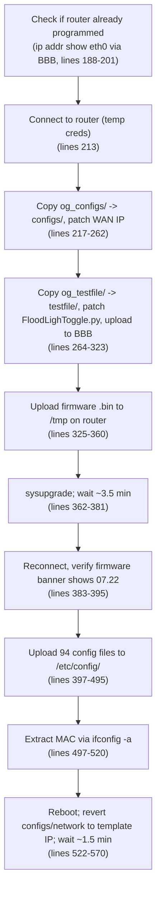
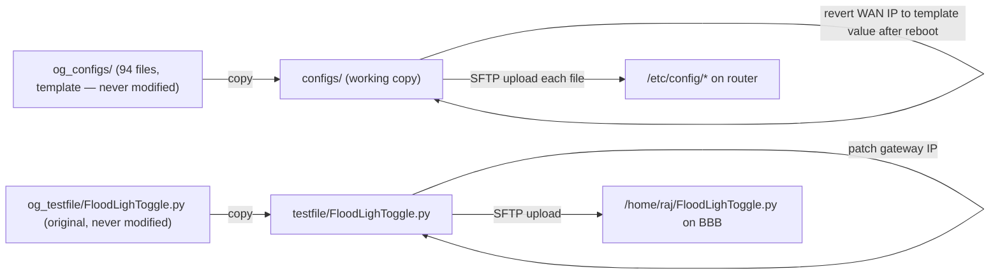

# WORKFLOW.md — TR Device

**Last commit:** `2e84f6c` — "DOCS.md file" (2026-07-30)

## 1. The two-process pipeline

`pages/program_page.py` `exec()`-loads `devices/TR/prog_dev.py` and calls its `run_main_script(airport, gate, temp_pass, device)` (`devices/TR/prog_dev.py:160`). That function does **not** talk to hardware itself — it looks up gate networking info from Excel, then launches `teltonika.py` as a separate child process and streams its output back.

```mermaid
sequenceDiagram
    participant PP as ProgramPage (exec'd prog_dev.py)
    participant TK as teltonika.py (subprocess)
    participant BBB as BeagleBone Black
    participant RTR as Router

    PP->>PP: lookup_excel(sheet, gate, "TR") — sets module globals gate_ip/netmask/gateway
    PP->>TK: subprocess.Popen([python, teltonika.py, gate_ip, netmask, gateway, temp_pass])
    TK->>BBB: SSH — check if router already programmed (ip addr show eth0)
    TK->>RTR: SSH (temp creds) — copy config templates, patch WAN IP
    TK->>BBB: SFTP — upload patched FloodLighToggle.py
    TK->>RTR: SFTP — upload firmware .bin, sysupgrade, wait ~3.5 min
    TK->>RTR: SSH (temp creds again) — verify firmware banner, push 94 config files
    TK->>RTR: shell — ifconfig -a, extract MAC
    TK->>RTR: reboot; revert local configs/network back to template IP
    TK-->>PP: stdout stream (captured line-by-line)
    PP->>PP: run_test_script(...) — functional test via BBB
    PP->>PP: write crash log / label file / update Excel cells
```

`prog_dev.py:192` builds the subprocess with `subprocess.Popen([sys.executable, script_path, str(gate_ip), str(gate_netmask), str(gate_gateway), str(temp_pass)], stdout=PIPE, stderr=STDOUT, text=True)` — `teltonika.py` reads these as `sys.argv[1:4]` at `devices/TR/teltonika.py:19-23`, and exits immediately (`sys.exit(0)`) if launched with no arguments at all.

## 2. `teltonika.py`'s 9 steps (as coded, `devices/TR/teltonika.py`)



Every step prints a verification message (`"...Found"` / `"Incorrect! ..."`) that `prog_dev.py` later scans for (`"Incorrect" in line`, `devices/TR/prog_dev.py:211`) to decide whether to treat the run as an error.

## 3. Config file lifecycle



This copy-then-patch-then-revert pattern exists so the same `og_configs`/`og_testfile` templates can be reused for the next gate without re-cloning from a pristine backup each time — `configs/network`'s WAN IP is patched to the gate's real IP for the duration of the SFTP push, then reverted back to the template placeholder (`10.28.18.2`) once the router has been rebooted (`devices/TR/teltonika.py:529-548`).

## 4. Excel / crash-log / label output (`prog_dev.py`)

`run_main_script` streams the child process's stdout and reacts to specific substrings as they arrive:

| Trigger substring | Action | Where |
|---|---|---|
| `"Incorrect"` | Write a crash log to `crash_logs/`, hyperlink it into column 10 of the gate's row, timestamp column 8 in red | `devices/TR/prog_dev.py:211-361` |
| `"MAC Addr:"` | Parse the MAC out of the line, write it into column 7 | `devices/TR/prog_dev.py:366-398` |
| `"Traceback"` | Set a flag; a second crash log gets written after the stream ends | `devices/TR/prog_dev.py:363,403-450` |
| *(end of stream, no error)* | Timestamp column 8 in black, clear the crash-log hyperlink cell | `devices/TR/prog_dev.py:452-504` |
| *(end of stream, unconditionally)* | Write a `router_labels/label_*.txt` file with gate/serial/router/MAC/IP, hyperlink it into column 9, increment the "programmed count" in column 11 | `devices/TR/prog_dev.py:506-569` |

`run_test_script` (`devices/TR/prog_dev.py:571`) then runs the functional test independently (see `CODE_EXPLAIN.md`), writing its own timestamp/crash-log/count into columns 12–14.

**Note on line numbers above:** several blocks contain unreachable code — e.g. `devices/TR/prog_dev.py:196-208` runs `run_test_script` *before* the loop at `:203` that re-reads `process.stdout` a second time, and that second read will yield nothing (the pipe was already fully consumed once by the first loop at `:193-194`). Treat the trigger table above as describing intent; the crash-log/label/MAC-column logic that depends on scanning `process.stdout` a second time may not actually execute in the way the code visually suggests. This is a candidate area to verify if labels/crash-logs seem to be missing in practice.
