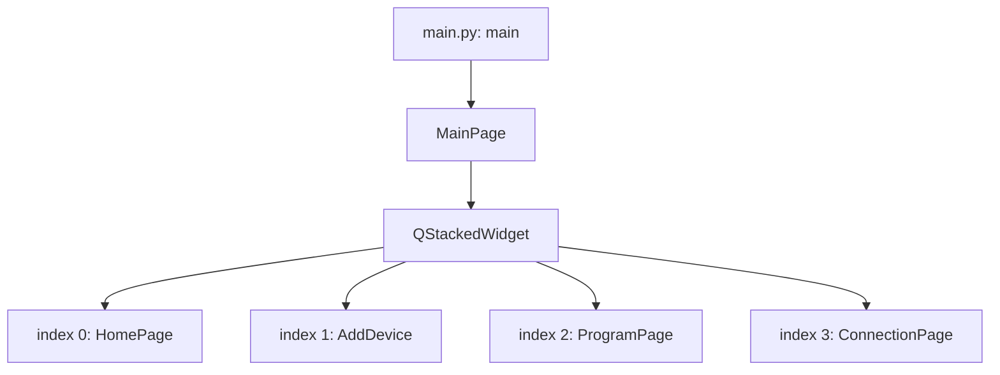
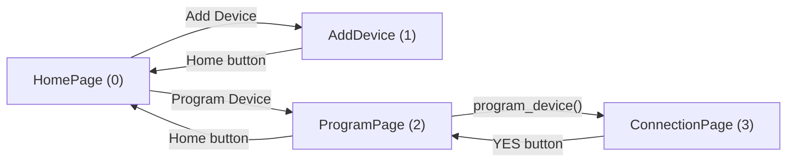
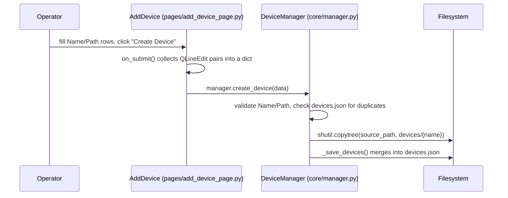
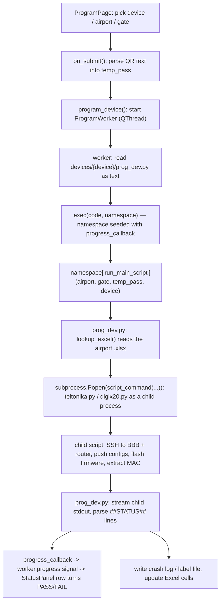
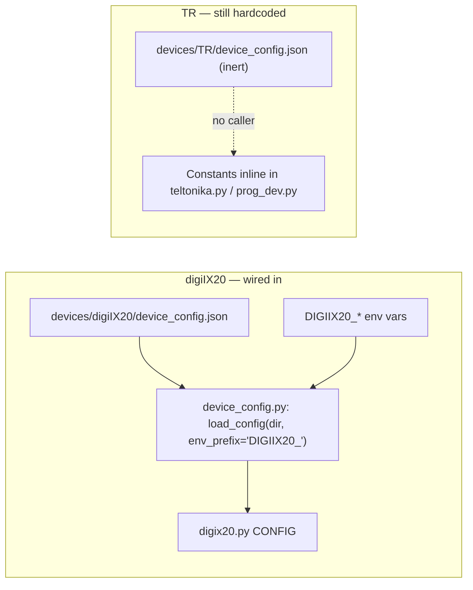

# WORKFLOW.md — Programming Workstation

**Last commit:** `79c2b64` (2026-08-03) — describes the workflow as of `ccd15af`, "Automate Digi IX20 flow, add live Status checklist, fix packaged build"

This file explains how the application's files interact at a navigation and data-flow level. For function-by-function detail, see `CODE_EXPLAIN.md`.

## Recent changes (`ccd15af`)

- **Programming no longer blocks the GUI.** `program_device()` hands the work to a `ProgramWorker(QThread)` and receives progress over Qt signals — see §4.
- **The exec namespace is no longer empty.** It is seeded with a `progress_callback`, which is how milestone updates reach the new Status panel — see §4.
- **A new startup phase runs before Qt exists**: working-directory pinning, script-runner mode, and UAC elevation — see §1.
- **Path resolution is centralised** in `resources/utilities/app_paths.py` so the app works both from source and as a packaged .exe with an external `devices/` folder — see §7.
- **Config resolution is now genuinely used** by the Digi (not by TR) — see §5.

## 1. Application startup

`main.py` now does three things *before* any Qt object exists (`main.py:1-30`):

1. **Pins the working directory** to `app_paths.app_root()` — the repo root from source, the folder holding the .exe when frozen. Everything else (`core/devices.json`, `logs/`, `devices/{device}/...`) resolves against it, so the app no longer has to be launched from the repo root.
2. **Checks for script-runner mode.** If invoked as `--run-script <path>`, it `runpy`s that script and exits instead of starting the GUI. This exists only for packaged builds — see §7.
3. **Ensures administrator rights** via `resources/utilities/elevate.py:ensure_admin`, which relaunches the app elevated through `ShellExecuteW(..., "runas", ...)` and exits the original process. Declining UAC is non-fatal: the app continues unelevated and only the Digi's static-IP milestone fails.

Only then does it build the `QApplication` and create one `MainPage` (`pages/main_window.py`). `MainPage.__init__` (`pages/main_window.py:14`) constructs a single `QStackedWidget` and instantiates all four pages against it up front — they all exist simultaneously in memory, and navigation is just switching which one is visible.



Every page holds a reference to the same `stacked_widget` and calls `setCurrentIndex(n)` on button clicks to navigate — there is no router or history stack, just direct index jumps (e.g. `pages/home_page.py:33-34`, `pages/connection_page.py:48`).

## 2. Page navigation



Note the `ConnectionPage`'s "YES" button (`pages/connection_page.py:48`) jumps straight to index `2` (`ProgramPage`) rather than being triggered *from* `ProgramPage` — in the current wiring, `ConnectionPage` is reachable only by manually navigating to index 3; nothing in `ProgramPage` currently sends the user there first. Hardware verification exists as a page but isn't gated into the main flow yet.

`QStackedWidget.currentChanged` is connected in `HomePage.__init__` (`pages/home_page.py:36`) to `on_page_changed` (`pages/home_page.py:53`), which calls `.refresh()` on whichever page just became visible, if it defines one. `HomePage.showEvent` (`pages/home_page.py:47`) and `ProgramPage.showEvent` (`pages/program_page.py:232`) both repopulate their device lists from `devices.registered_devices` every time the page is shown.

## 3. Registering a device type



`manager` (`core/manager.py:139`) is a module-level singleton constructed at import time — every page that does `from core.manager import manager` shares the same `DeviceManager` instance and the same in-memory `device_credentials` dict.

## 4. Programming a device — the main data flow

This is the app's central operation, and it crosses more files than any other flow.



**The run happens off the GUI thread.** `program_device()` (`pages/program_page.py`) validates the selections, resets the Status panel, disables the Program button and starts a `ProgramWorker(QThread)`; the worker does the `exec()` and the `run_main_script(...)` call in its own `run()`. Results come back as three signals — `progress(step_id, state, detail)`, `finished_ok()`, `failed(traceback_text)` — which Qt delivers on the GUI thread. Previously this all ran inline and froze the window for the whole provisioning cycle.

Key detail: the worker loads `prog_dev.py`'s source as a **string** and runs it with `exec(code, namespace)` — it is never `import`ed. That means:
- Static analysis / "find usages" tooling will not show the call edge from `ProgramPage` into `prog_dev.py`.
- Each device's `prog_dev.py` fully owns its own namespace when exec'd — top-level names it defines simply exist in that dict after `exec()` returns.
- The namespace is **not** empty: it is seeded with `{"progress_callback": self._emit_progress}`. A device script opts in by reading `globals().get("progress_callback")` — `devices/digiIX20/prog_dev.py` does, TR ignores it, and both work.
- `tests/test_prog_dev_integration.py` mirrors this loading mechanism with `importlib.util.spec_from_file_location`, because a plain `import devices.TR.prog_dev` wouldn't reflect how the real app invokes it.

`run_main_script` spawns the hardware script as a **separate OS process**, passing gate IP/netmask/gateway/temp-password as `sys.argv`. Both devices build the command with `resources.utilities.app_paths.script_command(...)` rather than `[sys.executable, ...]` — necessary because in a packaged build `sys.executable` is the app itself (§7). That subprocess does all the actual SSH/firmware work; `prog_dev.py` streams its stdout and post-processes Excel afterward. See `devices/TR/documentation/WORKFLOW.md` for TR's internal steps.

### Milestone reporting (`##STATUS##`)

`devices/digiIX20/digix20.py` prints a machine-readable marker alongside its normal human output whenever a milestone changes state:

```
##STATUS##<step_id>|<state>|<detail>      states: RUNNING PASS FAIL SENT WAIT
```

`devices/digiIX20/prog_dev.py` parses these in the **single** loop over the child's stdout, forwards them to `progress_callback`, and suppresses the marker lines from operator-facing output. The row labels come from `devices/{device}/checklist.json`, read by `pages/status_panel.py:load_checklist`. A device without that file gets an empty Status panel and is otherwise unaffected.

Failure propagation: `prog_dev.py` also watches for `Incorrect` / `Traceback` and honours the child's exit code, writes a crash log next to the device, and raises. The worker catches it, emits `failed`, and `ProgramPage.on_program_failed` writes the traceback to `sys.stderr` **from the GUI thread** — deliberately, because `error_log_page`'s interceptor opens a modal dialog on stderr writes, which is only safe on the Qt thread (§6).

## 5. Configuration resolution — target vs. actual

`resources/utilities/device_config.py:36` implements a three-tier precedence (`DEFAULTS` → `device_config.json` → `{PREFIX}_*` env vars), fully covered by `tests/test_device_config.py`. **The two devices differ in whether they use it.**



- **digiIX20** calls `load_config(DEVICE_DIR, env_prefix="DIGIIX20_")` at the top of `digix20.py`, so every IP, credential, filename and timeout comes from `devices/digiIX20/device_config.json` and can be overridden per-machine with `DIGIIX20_*` environment variables.
- **TR** still hardcodes BBB/router IPs and passwords in source (e.g. `devices/TR/teltonika.py`, `devices/TR/prog_dev.py`). `devices/TR/device_config.json` exists on disk but nothing reads it, so `TR_*` variables have no effect.

The same split applies to the rest of the shared layer: `digix20.py` uses `SSHSession`/`ManagedShell`, `wait_utils`, and `mac_utils.extract_mac`, while TR's scripts still use raw `paramiko.SSHClient` and their own inline parsers. On Excel, `devices/digiIX20/prog_dev.py` calls the shared `lookup_excel(sheet, gate)` (`resources/utilities/excel_utils.py:33`), whereas `devices/TR/prog_dev.py:118` defines its own diverging 3-argument version locally.

## 6. Error handling

`pages/error_log_page.py` installs its hooks at **import time** (`install_error_handler()` called unconditionally at module scope), which is why simply importing it anywhere (as `main.py` does) activates global exception/stdout/stderr capture for the whole process. `_collect_output` buffers every line and pops a single `LogDialog` on first error — `_error_popup_shown` prevents dialog spam on repeated failures. `atexit.register(_show_log_on_exit)` guarantees one final log dialog even on clean exit.

Two consequences worth keeping in mind when touching this flow:

- **A stderr write is what raises the dialog**, and `LogDialog.exec_()` is a modal Qt call. Anything writing to stderr from a non-GUI thread would therefore be unsafe, which is why `ProgramWorker` emits a `failed` signal and lets `ProgramPage` do the actual `sys.stderr.write` (§4).
- **In a packaged windowed build there are no streams at all.** PyInstaller with `console=False` leaves `sys.stdout`, `sys.stderr` and their `__stdout__`/`__stderr__` originals all `None`. `StreamInterceptor` now routes every raw write through `_write_raw()`, which no-ops on a `None` or closed stream; before that, the first `print()` in the app raised `AttributeError` and the packaged GUI died before its window appeared. The log file and dialog still work in that mode — which is how the failure was diagnosed.

## 7. Running from source vs. packaged

`resources/utilities/app_paths.py` is the single place that answers "where are things", and it distinguishes two roots:

- `app_root()` — mutable, extensible data: `devices/`, `core/`, `logs/`. The repo root from source; the folder containing the .exe when frozen.
- `bundle_root()` — read-only assets shipped inside the build (`resources/images/`), which PyInstaller unpacks to `sys._MEIPASS`.

`devices/` is deliberately **outside** the bundle so a device can be added by dropping in a folder without a rebuild, and because the app writes into that tree at runtime (Excel stamps, `router_labels/`, `crash_logs/`). `devices/__init__.py` scans `app_root()/devices` rather than its own package directory, which is what makes the bundled package see the external folder.

One knock-on effect: frozen, `sys.executable` is the app rather than a Python interpreter, so `prog_dev.py` cannot spawn a hardware script directly. `script_command()` returns `[main.exe, --run-script, <script>, ...]` in that case, and `main.py`'s startup handles the flag (§1). From source it returns the ordinary `[python.exe, <script>, ...]`.

See `../SETUP.md` §6 for the build command and the required post-build staging of `devices/`.
