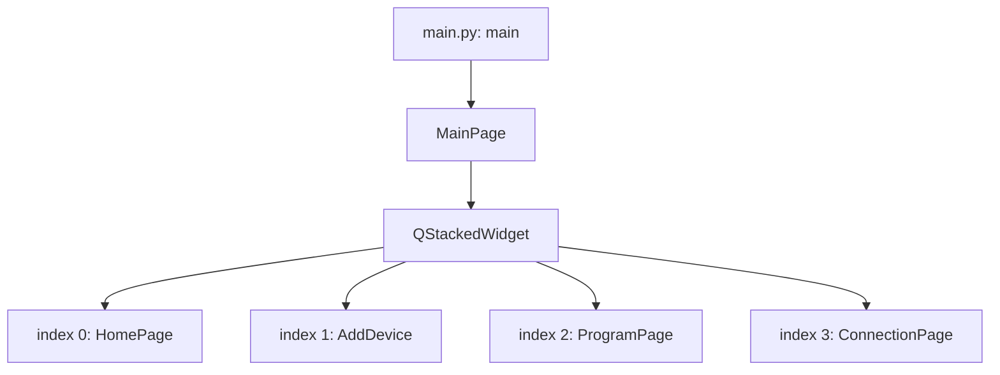
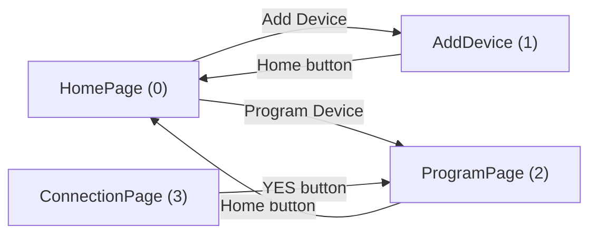
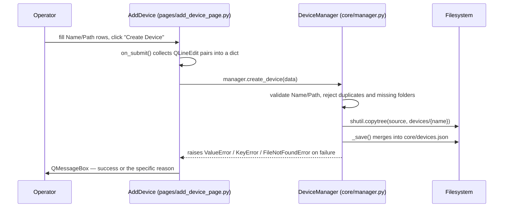
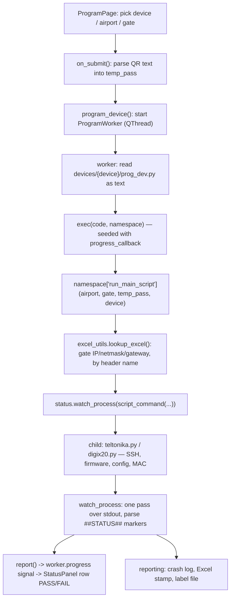
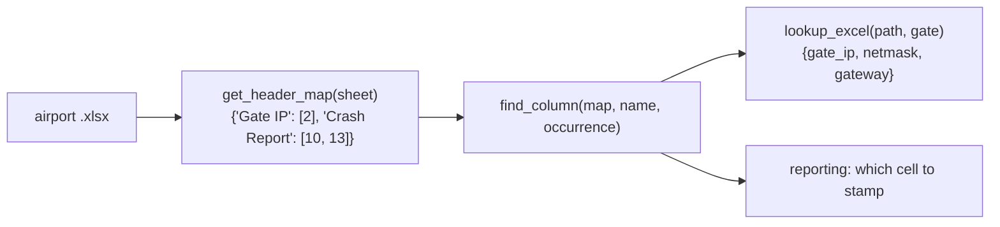
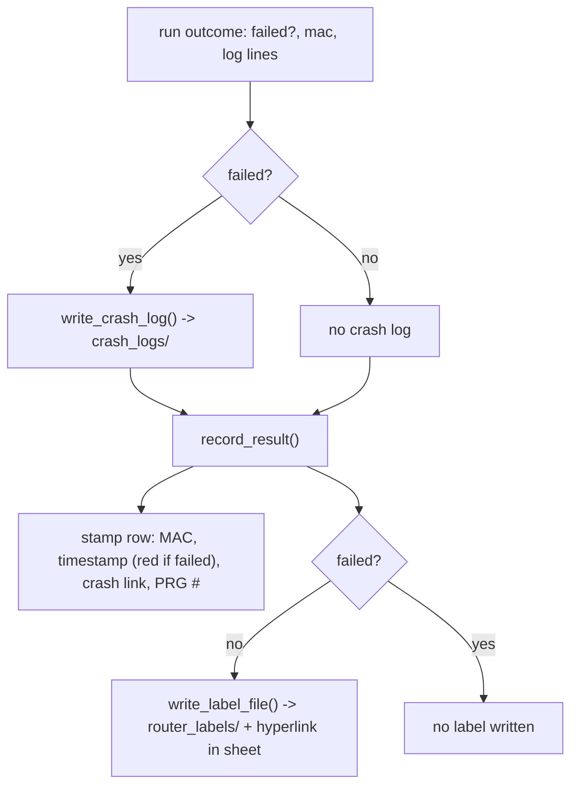

# WORKFLOW.md — Programming Workstation

**Last commit:** `e96074a` (2026-08-04) — "Simplify onto a shared utility layer; delete dead abstractions"

This file explains how the application's files interact at a navigation and data-flow level. For function-by-function detail, see `CODE_EXPLAIN.md`. For a version of this with no code in it at all, see [`CHEAT_SHEET.md`](CHEAT_SHEET.md).

## Recent changes

**Latest — `teltonika.py` migrated.** TR's hardware script is now seven dispatched milestones on the shared layer, with pooled connections and completion-driven waits in place of fixed sleeps. TR ships a `checklist.json`, so it has the live Status panel too, and `og_*` template staging moved into `resources/utilities/templating.py`, shared with `prog_dev.py` (§5a).

Earlier, in `e96074a`:

- **Both devices now share one utility layer.** The TR/Digi split that ran through the previous revision of this file is gone — see §6, which no longer needs a "target vs. actual" section.
- **The child-process output loop is shared and runs once.** `status.watch_process()` replaces a hand-written loop in each `prog_dev.py`; TR's ran twice over the same pipe and the second pass did nothing — see §4.
- **End-of-run bookkeeping is one module**, `resources/utilities/reporting.py` — see §6.
- **Spreadsheets are read by column name.** `excel_utils` resolves every column through the header row — see §5.
- **`device_types/` was deleted** (four files of working code that nothing ever instantiated), so the three pages that did `from device_types import *` no longer do — see §2.

## 1. Application startup

`main.py` does three things *before* any Qt object exists (`main.py:1-30`):

1. **Pins the working directory** to `app_paths.app_root()` — the repo root from source, the folder holding the .exe when frozen. Everything else (`core/devices.json`, `logs/`, `devices/{device}/...`) resolves against it, so the app no longer has to be launched from the repo root.
2. **Checks for script-runner mode.** If invoked as `--run-script <path>`, it `runpy`s that script and exits instead of starting the GUI. This exists only for packaged builds — see §8.
3. **Ensures administrator rights** via `resources/utilities/elevate.py:ensure_admin`, which relaunches the app elevated through `ShellExecuteW(..., "runas", ...)` and exits the original process. Declining UAC is non-fatal: the app continues unelevated and only the Digi's static-IP milestone fails.

Only then does it build the `QApplication` and create one `MainPage` (`pages/main_window.py`). `MainPage.__init__` (`pages/main_window.py:14`) constructs a single `QStackedWidget` and instantiates all four pages against it up front — they all exist simultaneously in memory, and navigation is just switching which one is visible.



Every page holds a reference to the same `stacked_widget` and calls `setCurrentIndex(n)` on button clicks to navigate — there is no router or history stack, just direct index jumps. `HomePage` now names its two targets as constants (`pages/home_page.py:9-10`) rather than repeating bare integers.

## 2. Page navigation



`ConnectionPage` is reachable only by manually navigating to index 3; nothing in `ProgramPage` sends the user there first. Hardware verification exists as a page but is not gated into the main flow — the per-device cabling checkboxes on `ProgramPage` (from `instructions.txt`) are what actually gate the Program button.

`QStackedWidget.currentChanged` is connected in `HomePage.__init_ui` (`pages/home_page.py:51`) to `on_page_changed` (`pages/home_page.py:53`), which calls `.refresh()` on whichever page just became visible, if it defines one. `ProgramPage.refresh` (`pages/program_page.py:318`) re-reads the registry through `manager.names()`.

That last point is a change: pages used to read the module-level `devices.registered_devices`, a list computed **once at import time**, so a device added during a session did not appear until restart. `devices/__init__.py` no longer performs that scan (or its import-time `print`); discovery is lazy, through `core/manager.py` or `app_paths.registered_devices()`.

## 3. Registering a device type



`manager` (`core/manager.py:115`) is a module-level singleton constructed at import time — every page that does `from core.manager import manager` shares it.

`create_device` now **raises** on bad input instead of printing and returning, and `AddDevice.on_submit` turns that into a dialog. Previously a missing `Name`/`Path` printed to stdout and then called `create_device` anyway with the incomplete dict; in a packaged windowed build there is no console, so the operator saw nothing happen at all.

## 4. Programming a device — the main data flow

This is the app's central operation, and it crosses more files than any other flow.



**The run happens off the GUI thread.** `program_device()` (`pages/program_page.py:183`) validates the selections, resets the Status panel, disables the Program button and starts a `ProgramWorker(QThread)`; the worker does the `exec()` and the `run_main_script(...)` call in its own `run()`. Results come back as three signals — `progress(step_id, state, detail)`, `finished_ok()`, `failed(traceback_text)` — which Qt delivers on the GUI thread.

The worker loads `prog_dev.py`'s source as a **string** and runs it with `exec(code, namespace)` — it is never `import`ed. That means:

- Static analysis / "find usages" tooling will not show the call edge from `ProgramPage` into `prog_dev.py`.
- The script has no reliable `__file__`, which is why both `prog_dev.py` files resolve paths through `app_paths.device_dir(device)` rather than relative to themselves.
- The namespace is **not** empty: it is seeded with `{"progress_callback": self._emit_progress}`. A device script opts in by reading `globals().get("progress_callback")`; both do, via `status.forwarder()`.
- `tests/test_prog_dev_integration.py` mirrors this loading mechanism with `importlib.util.spec_from_file_location`, because a plain `import devices.TR.prog_dev` wouldn't reflect how the real app invokes it.

`run_main_script` spawns the hardware script as a **separate OS process**, passing gate IP/netmask/gateway/temp-password as `sys.argv`. Both devices build the command with `app_paths.script_command(...)` rather than `[sys.executable, ...]` — necessary because in a packaged build `sys.executable` is the app itself (§8).

### Milestone reporting (`##STATUS##`)

`resources/utilities/status.py` owns **both ends** of the child-to-GUI conversation. A hardware script announces a milestone with a machine-readable marker alongside its normal human output:

```
##STATUS##<step_id>|<state>|<detail>    states: RUNNING PASS FAIL SENT WAIT SKIPPED
```

`digix20.py` emits these through thin aliases (`digix20.py:65-70` → `status.emit`/`running`/`passed`/…). `status.parse()` reads them back. Keeping the literal in one module fixed a real hazard: when each side carried its own copy, changing one silently stopped the other from recognising anything.

`status.watch_process(command, report)` (`resources/utilities/status.py:127`) is the loop that runs the child and consumes its output. It makes exactly **one** pass over `process.stdout`, forwarding markers to `report`, printing everything else for the operator, keeping a 200-line rolling buffer for the crash log, and watching for the two output conventions both scripts follow — `Incorrect` for a failure and `MAC Addr:` for the device's MAC.

> That single pass is the fix for a real bug. `devices/TR/prog_dev.py` used to loop over `process.stdout` twice. The first loop drained the pipe, so the second — which held all the failure detection, MAC capture and crash logging — iterated an already-exhausted stream and did nothing. Every TR run recorded a success with a black timestamp and no MAC.

Row labels come from `devices/{device}/checklist.json`, read by `pages/status_panel.py:load_checklist`. A device without that file gets an empty Status panel and is otherwise unaffected. `status.forwarder()` wraps the GUI callback so an exception while drawing a tick mark can never abandon a router mid-flash.

Failure propagation: `run_main_script` raises, the worker catches it and emits `failed`, and `ProgramPage.on_program_failed` writes the traceback to `sys.stderr` **from the GUI thread** — deliberately, because `error_log_page`'s interceptor opens a modal dialog on stderr writes, which is only safe on the Qt thread (§7).

## 5. Reading the gate spreadsheets

Every airport sheet has the same header row (`devices/*/IP_TEMPLATE.xlsx`):

```
PBB Gate | Gate IP | Netmask | Gateway | PBB SN | Jetway PN | MAC Address |
Router Programmed On | Label | Crash Report | PRG # | Router Tested On |
Crash Report | Test # | Notes
```

`resources/utilities/excel_utils.py` resolves every column through that row:



Two details that drove the design:

- **"Crash Report" appears twice** — once for the programming run, once for the functional test. `get_header_map` therefore returns a *list* of column numbers per name, and `find_column` takes an `occurrence`.
- **`lookup_excel` raises rather than returning blanks** (`excel_utils.py:135`). A `KeyError` means the gate is not in the sheet; a `ValueError` means the headers are missing or the address/netmask pair is unusable. Both stop the run before any hardware is touched. It also validates the address against its own netmask via `network_utils.validate_subnet`, which caught the real `255.255.255.128` gates where a hardcoded `/24` assumption put the PC on the wrong subnet.

`devices/TR/prog_dev.py` keeps a 3-argument `lookup_excel(sheet, gate, device)` that sets module globals and a `valid_ip` flag rather than raising — that is the shape the GUI and its tests expect for TR — but it delegates the actual reading to the shared function (`devices/TR/prog_dev.py:100`).

## 6. Configuration and end-of-run reporting

**Configuration** resolves through `resources/utilities/device_config.py:36` with three tiers — `DEFAULTS` → `device_config.json` → `{PREFIX}_*` environment variables. Both devices now use it:

| Device | Call site | Env prefix |
| --- | --- | --- |
| digiIX20 | `digix20.py:48` | `DIGIIX20_` |
| TR — orchestration | `devices/TR/prog_dev.py:160` | `TR_` |
| TR — hardware script | `devices/TR/teltonika.py:55` | `TR_` |

Both TR call sites are new. `devices/TR/device_config.json` had existed on disk since the config system was introduced, but nothing loaded it, so `TR_*` variables had no effect and the addresses, credentials, firmware filename and every timeout were hardcoded in the scripts. They are all in the JSON now.

**Reporting** — everything a run leaves behind — is `resources/utilities/reporting.py`:



Two conventions this module enforces for both devices:

- The **"Router Programmed On" timestamp is red on failure, black on success**. That colour is how an operator scanning the sheet spots a gate that needs redoing.
- **A failed run still stamps the sheet but writes no label.** A printable label for a router that did not program is worse than none, because somebody can stick it on.

`record_test_result` (`reporting.py:221`) does the same for the functional-test columns, which is TR's second pass over the hardware.

## 7. Error handling

`pages/error_log_page.py` installs its hooks at **import time** (`install_error_handler()` called unconditionally at module scope), which is why simply importing it anywhere (as `main.py` does) activates global exception/stdout/stderr capture for the whole process. `_collect_output` buffers every line and pops a single `LogDialog` on first error — `_error_popup_shown` prevents dialog spam. `atexit.register(_show_log_on_exit)` guarantees one final log dialog even on clean exit.

Two consequences worth keeping in mind when touching this flow:

- **A stderr write is what raises the dialog**, and `LogDialog.exec_()` is a modal Qt call. Anything writing to stderr from a non-GUI thread would therefore be unsafe, which is why `ProgramWorker` emits a `failed` signal and lets `ProgramPage` do the actual `sys.stderr.write` (§4).
- **In a packaged windowed build there are no streams at all.** PyInstaller with `console=False` leaves `sys.stdout`, `sys.stderr` and their `__stdout__`/`__stderr__` originals all `None`. `StreamInterceptor` routes every raw write through `_write_raw()`, which no-ops on a `None` or closed stream; before that, the first `print()` in the app raised `AttributeError` and the packaged GUI died before its window appeared.

## 8. Running from source vs. packaged

`resources/utilities/app_paths.py` is the single place that answers "where are things", and it distinguishes two roots:

- `app_root()` — mutable, extensible data: `devices/`, `core/`, `logs/`. The repo root from source; the folder containing the .exe when frozen.
- `bundle_root()` — read-only assets shipped inside the build (`resources/images/`), which PyInstaller unpacks to `sys._MEIPASS`.

`devices/` is deliberately **outside** the bundle so a device can be added by dropping in a folder without a rebuild, and because the app writes into that tree at runtime (Excel stamps, `router_labels/`, `crash_logs/`).

One knock-on effect: frozen, `sys.executable` is the app rather than a Python interpreter, so `prog_dev.py` cannot spawn a hardware script directly. `script_command()` returns `[main.exe, --run-script, <script>, ...]` in that case, and `main.py`'s startup handles the flag (§1). From source it returns the ordinary `[python.exe, <script>, ...]`.

See `SETUP.md` §6 for the build command and the required post-build staging of `devices/`.
