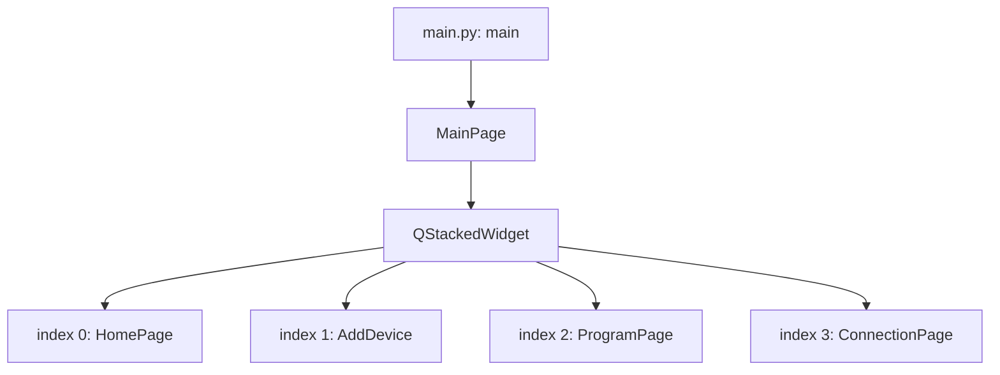
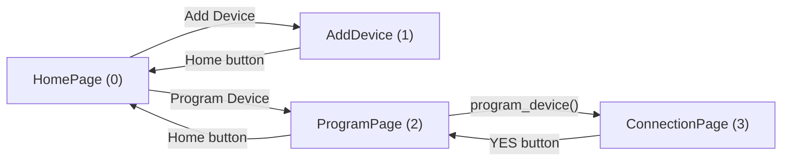
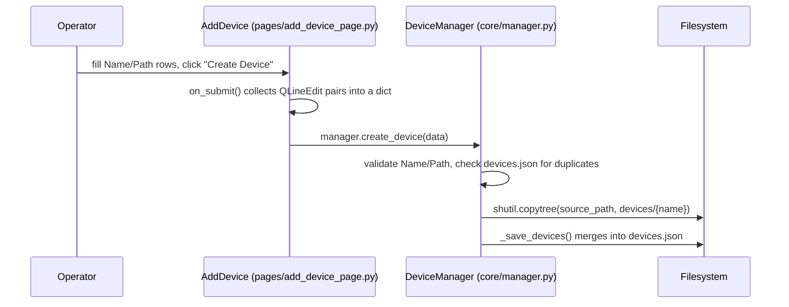
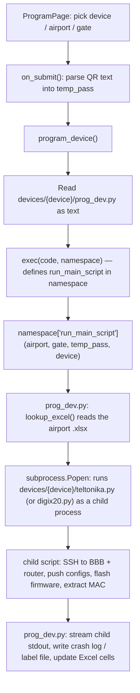
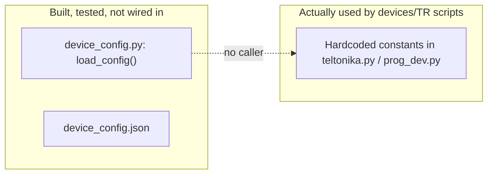

# WORKFLOW.md — Programming Workstation

**Last commit:** `2e84f6c` — "DOCS.md file" (2026-07-30)

This file explains how the application's files interact at a navigation and data-flow level. For function-by-function detail, see `CODE_EXPLAIN.md`.

## 1. Application startup

`main.py` builds the `QApplication`, applies a Fusion style and stylesheet, and creates one `MainPage` (`pages/main_window.py`). `MainPage.__init__` (`pages/main_window.py:14`) constructs a single `QStackedWidget` and instantiates all four pages against it up front — they all exist simultaneously in memory, and navigation is just switching which one is visible.

Every page holds a reference to the same `stacked_widget` and calls `setCurrentIndex(n)` on button clicks to navigate — there is no router or history stack, just direct index jumps (e.g. `pages/home_page.py:33-34`, `pages/connection_page.py:48`).

## 2. Page navigation

Note the `ConnectionPage`'s "YES" button (`pages/connection_page.py:48`) jumps straight to index `2` (`ProgramPage`) rather than being triggered *from* `ProgramPage` — in the current wiring, `ConnectionPage` is reachable only by manually navigating to index 3; nothing in `ProgramPage` currently sends the user there first. Hardware verification exists as a page but isn't gated into the main flow yet.

`QStackedWidget.currentChanged` is connected in `HomePage.__init__` (`pages/home_page.py:36`) to `on_page_changed` (`pages/home_page.py:53`), which calls `.refresh()` on whichever page just became visible, if it defines one. `HomePage.showEvent` (`pages/home_page.py:47`) and `ProgramPage.showEvent` (`pages/program_page.py:232`) both repopulate their device lists from `devices.registered_devices` every time the page is shown.

## 3. Registering a device type

`manager` (`core/manager.py:139`) is a module-level singleton constructed at import time — every page that does `from core.manager import manager` shares the same `DeviceManager` instance and the same in-memory `device_credentials` dict.

## 4. Programming a device — the main data flow

This is the app's central operation, and it crosses more files than any other flow.

Key detail: `pages/program_page.py:134,151` loads `prog_dev.py`'s source as a **string** and runs it with `exec(code, namespace)` — it is never `import`ed. That means:
- Static analysis / "find usages" tooling will not show the call edge from `ProgramPage` into `prog_dev.py`.
- Each device's `prog_dev.py` fully owns its own namespace when exec'd — top-level names it defines (including any `lookup_excel`, `is_valid_ip`, etc.) simply exist in that dict after `exec()` returns; nothing from `pages/program_page.py`'s own imports leaks in except what's already in the passed `namespace` (empty, in this case).
- `tests/test_prog_dev_integration.py:24-31` mirrors this exact loading mechanism with `importlib.util.spec_from_file_location`, specifically because a plain `import devices.TR.prog_dev` wouldn't reflect how the real app invokes it.

`prog_dev.py`'s `run_main_script` (`devices/TR/prog_dev.py:160`) itself spawns **teltonika.py as a separate OS process** via `subprocess.Popen` (`devices/TR/prog_dev.py:192`), passing gate IP/netmask/gateway/temp-password as `sys.argv`. That subprocess does all of the actual SSH/firmware work; `prog_dev.py` only streams its stdout back into the GUI and post-processes the Excel file afterward. See `devices/TR/documentation/WORKFLOW.md` for that subprocess's internal steps.

## 5. Configuration resolution — target vs. actual

`resources/utilities/device_config.py:36` implements a three-tier precedence (`DEFAULTS` → `device_config.json` → `{PREFIX}_*` env vars), fully covered by `tests/test_device_config.py`. **However**, neither `devices/TR/teltonika.py` nor `devices/TR/prog_dev.py` calls `load_config()` anywhere — both hardcode BBB/router IPs and passwords directly in source (e.g. `devices/TR/teltonika.py:57-59`, `devices/TR/prog_dev.py:46-48`). `devices/TR/device_config.json` exists on disk but is presently inert — nothing reads it.

The digiIX20 implementation is a partial exception: `devices/digiIX20/prog_dev.py:2` imports `lookup_excel` from `resources.utilities.excel_utils` and calls it with the shared 2-argument signature (`lookup_excel(sheet, gate)`), matching the utility module's actual current signature (`resources/utilities/excel_utils.py:33`). The TR device's own `prog_dev.py` instead defines its own 3-argument `lookup_excel(sheet, gate, device)` locally (`devices/TR/prog_dev.py:118`) that duplicates (and diverges from) the shared one.

## 6. Error handling

`pages/error_log_page.py` installs its hooks at **import time** (`pages/error_log_page.py:163`, `install_error_handler()` called unconditionally at module scope), which is why simply importing it anywhere (as `main.py:9` does) activates global exception/stdout/stderr capture for the whole process. `_collect_output` (`pages/error_log_page.py:60`) buffers every line and pops a single `LogDialog` (`pages/error_log_page.py:25`) on first error — `_error_popup_shown` prevents dialog spam on repeated failures. `atexit.register(_show_log_on_exit)` (`pages/error_log_page.py:159`) guarantees one final log dialog even on clean exit.
